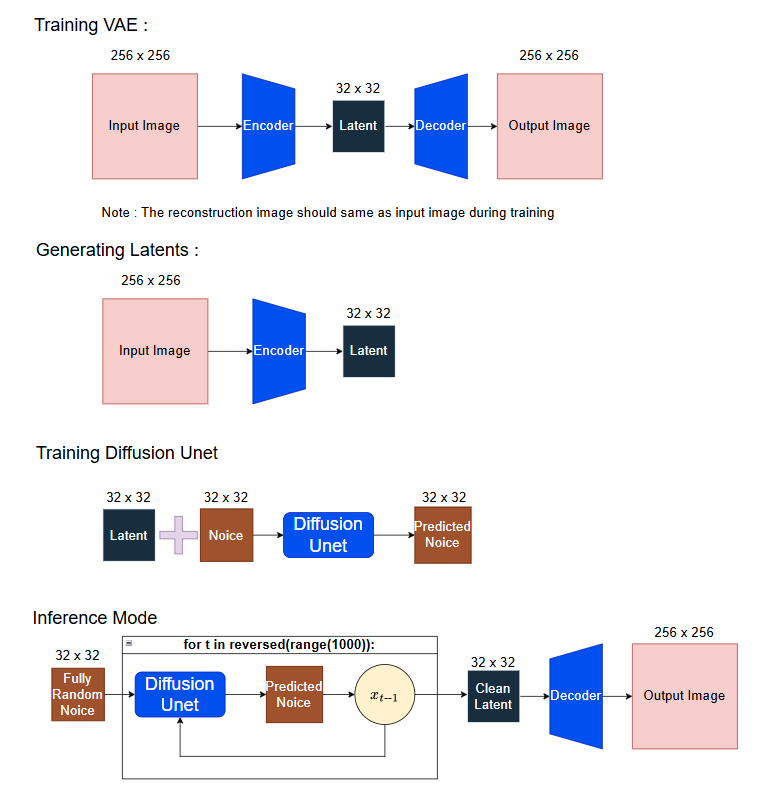

# Latent Diffusion From Scratch

An implementation of Unconditional Image Generation , Latent Diffusion Model (LDM) built from scratch using PyTorch.

<p>
  
</p>

*Generated samples using the custom trained model.*

## Architecture Overview
There is 2 models to be trained , Variational AutoEncoders (VAE) and Diffusion U-Net



## More Details Architecture Explanation
Need flowchart for clearer explanation ?
[**Click here to browse the architecture flowcharts**](FlowChart/)

I have provided the source file for anyone who wants to study the architecture deeply or modify the diagrams.

* **[Download Source File (.drawio)](FlowChart.drawio)**
  
*(Note: To open this file, go to [app.diagrams.net](https://app.diagrams.net/) in your browser and drag-and-drop the file onto the canvas.)*

To view my draft and notes when studying Latent Diffusion :

[View the Draft and Notes](https://1drv.ms/o/c/eae736d6f2d45eed/IgAV2N1tMUu1QaddKr_KNX88AeZ-4xvzktsisAO-h5fDtRE?e=DPCh6h)

*(Note: The codes wrote inside notes might be differ with the actual implementing codes)*

## Pre-trained Models
You can download the trained weights from Google Drive:

* **[Download Pre-trained Weights Folder](https://drive.google.com/drive/folders/1EbwM13No2i44OCQbxzMkeORkeEqaT9IU?usp=sharing)**
  * `checkpoint.pth` (VAE Autoencoder)
  * `unet_epoch_500.pth` (Diffusion Model)

**Setup:**
1. Download both files.
2. Place them inside your project folder (or upload to Colab).


## Codes Implementation
For training code (Just View) :
[](https://colab.research.google.com/github/Yang-star-source/Latent_Diffusion_From_Scratch/blob/main/Latent_Diffusion_From_Scratch.ipynb)

For Inference Mode (One Click Run):
[](https://colab.research.google.com/github/Yang-star-source/Latent_Diffusion_From_Scratch/blob/main/Latent_Diffusion_From_Scratch_Inference.ipynb)

## Dataset 
```bibtex
@inproceedings{choi2020starganv2,
  title={StarGAN v2: Diverse Image Synthesis for Multiple Domains},
  author={Yunjey Choi and Youngjung Uh and Jaejun Yoo and Jung-Woo Ha},
  booktitle={Proceedings of the IEEE Conference on Computer Vision and Pattern Recognition},
  year={2020}
}
```

[Dataset from Kaggle](https://www.kaggle.com/datasets/andrewmvd/animal-faces)

## Study Resources

### Papers
* **Denoising Diffusion Probabilistic Models** - [Ho et al. (2020)](https://arxiv.org/abs/2006.11239)
* **Attention Is All You Need** - [Vaswani et al. (2017)](https://arxiv.org/abs/1706.03762)
* **High-Resolution Image Synthesis with Latent Diffusion Models** - [Rombach et al. (2021)](https://arxiv.org/abs/2112.10752)

### Articles
* **Diffusion Model from Scratch** - [Hugging Face](https://huggingface.co/learn/diffusion-course/unit1/3)
* **KL Divergence** - [GeeksforGeeks](https://www.geeksforgeeks.org/machine-learning/kullback-leibler-divergence/)

### Videos
* [Diffusion Models: DDPM | Generative AI Animated](https://www.youtube.com/watch?v=EhndHhIvWWw) – Excellent visualization of the forward/reverse process.
* [The Key Equation Behind Probability](https://www.youtube.com/watch?v=KHVR587oW8I) (Artem Kirsanov) – Essential for understanding the entropy/KL-divergence math.
* [Attention in transformers, step-by-step](https://www.3blue1brown.com/lessons/attention) (3Blue1Brown) – Visual breakdown of the Attention Mechanism.
